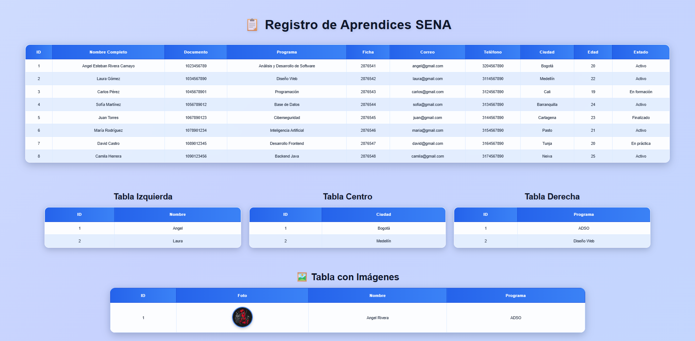

# 📋 Tabla HTML con CSS

Proyecto realizado con HTML5 y CSS3.

## 🚀 Descripción

Este proyecto contiene diferentes tablas estilizadas utilizando:

- HTML
- CSS externo
- Animaciones
- Fondos animados
- Imágenes en tablas
- Alineación de texto
- Diferentes posiciones de tablas

---

## 🎨 Características

✅ Tabla principal estilizada  
✅ Tablas alineadas a la izquierda, centro y derecha  
✅ Tabla con imágenes  
✅ Fondo animado  
✅ Animaciones suaves  
✅ Diseño moderno  
✅ Uso de `cellpadding` y `cellspacing`  
✅ CSS externo  

---

## 🛠️ Tecnologías utilizadas

- HTML5
- CSS3

---

## 🌐 Proyecto en línea

🔗 [Ver proyecto](https://angelcamayojm-wq.github.io/Tabla-html-css/)

---

## 📸 Vista previa

---

## 👨‍💻 Autor

- Angel Esteban Rivera Camayo

---

## 📚 Aprendizajes

Durante este proyecto se practicó:

- Creación de tablas en HTML
- Estilos externos con CSS
- Animaciones
- Alineación de contenido
- Uso de imágenes
- Publicación con GitHub Pages
