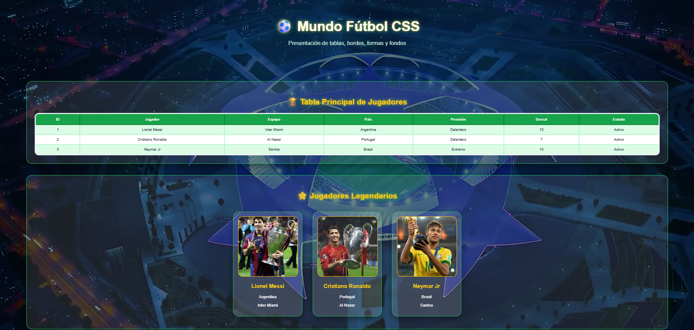

# ⚽ Mundo Fútbol CSS

Proyecto web realizado con **HTML5** y **CSS3**, inspirado en el mundo del fútbol y la Champions League.  
La página funciona como una presentación visual de diferentes propiedades de CSS aplicadas en tablas, bordes, fondos, formas, imágenes superpuestas, video de fondo y efectos visuales.

---

## 🌐 Proyecto en línea

🔗 [Ver página publicada](https://angelcamayojm-wq.github.io/Tabla-html-css/)

---

## 📸 Vista previa




---

## 🏆 Descripción del proyecto

Este proyecto muestra una página temática de fútbol donde se aplican diferentes conceptos de HTML y CSS.  
El diseño incluye una estética deportiva con video de fondo, colores neón, tablas estilizadas, tarjetas de jugadores, ejemplos de bordes, formas con `border-radius`, fondos con distintas propiedades y una escena construida con imágenes superpuestas.

La idea principal es demostrar de forma visual cómo funcionan varias propiedades importantes de CSS dentro de una página web real.

---

## 🛠️ Tecnologías utilizadas

- HTML5
- CSS3
- GitHub Pages
- Video en formato MP4
- Imágenes PNG y JPG

---

## ✨ Características principales

- 🎥 Video de fondo con capa oscura.
- 🏆 Tabla principal de jugadores.
- 📊 Tablas alineadas.
- 🃏 Tarjetas visuales de jugadores legendarios.
- 🧱 Ejemplos de `border-style`.
- 🔵 Uso de `border-radius` en formas.
- ⚽ Fondos con `background-image`.
- 🔁 Ejemplo de `background-repeat`.
- 🖼️ Ejemplo de `background-size: cover`.
- 📐 Ejemplo de `background-size: contain`.
- 📍 Uso de `background-position`.
- 🎯 Imagen sobre otra para crear una escena de tiro libre.
- ✨ Efectos `hover`.
- 🌟 Sombras y brillos con `box-shadow`.

---

## 📚 Temas practicados

Durante el desarrollo del proyecto se practicaron los siguientes temas:

- Creación de tablas en HTML.
- Uso de `table`, `tr`, `th` y `td`.
- Uso de `cellpadding` y `cellspacing`.
- Estilos externos con CSS.
- Colores y fondos.
- Bordes con diferentes estilos.
- Propiedades:
  - `border-width`
  - `border-style`
  - `border-color`
  - `border-radius`
- Alineación de texto con `text-align`.
- Uso de imágenes en CSS.
- Fondos con:
  - `background-color`
  - `background-image`
  - `background-repeat`
  - `background-size`
  - `background-position`
  - `background-attachment`
- Diferencias entre `cover` y `contain`.
- Superposición de imágenes.
- Video de fondo.
- Efectos visuales con `transition`, `transform` y `hover`.
- Organización visual por secciones.

---

## 📁 Estructura del proyecto

```text
Tabla-html-css/
│
├── index.html
├── style.css
├── README.md
│
├── imagenes/
│   ├── fondo.png
│   ├── balon.png
│   ├── barrera.png
│   ├── cancha.png
│   ├── champions.png
│   ├── cristiano.png
│   ├── escudo.png
│   ├── messi.png
│   ├── neymar.png
│   └── tirolibre.png
│
└── videos/
    └── video-futbol.mp4

---

## 👨‍💻 Autor

- Angel Esteban Rivera Camayo

---